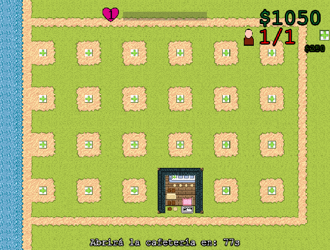
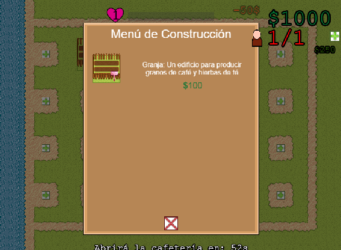
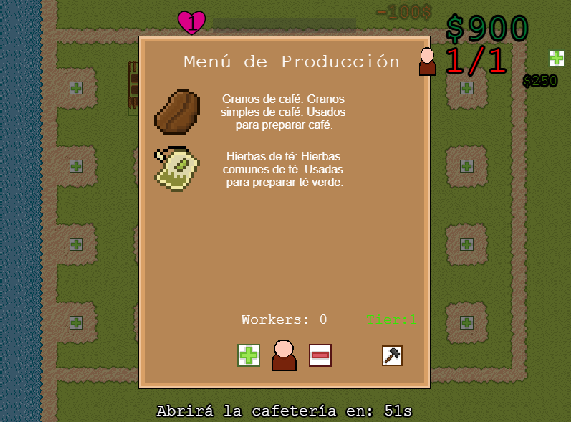
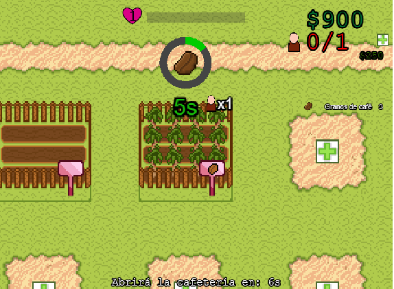

# Far Away From Tea

> *Trabajo universitario desarrollado como parte de la asignatura de 2º año Programación de Videojuegos en Lenguajes Interpretados, en la Universidad Complutense de Madrid.*

---

## Descripción general

Te encargas de gestionar y expandir una cafetería, construyendo nuevos edificios para conseguir materias primas y producir una gran variedad de productos que los clientes
te pedirán durante el día. Mejorarás los edificios y conseguirás nuevos trabajadores que te ayudarán a ser más eficiente en tu objetivo de convertirte en la cafetería más
famosa del mundo.

Genero: Construcción de bases y gestión de recursos. Con vista top-down.

---

## Características principales

● Gestión de recursos.  
● Construcción de edifi cios para producir y procesar recursos.  
● Venta de productos a los clientes.  
● Mejora de popularidad y expansión de la base.  
● Estética pixel art en 2D y atmósfera amigable y sencilla.  
● Especial importancia en la gestión efi ciente de la cafetería para crecer lo más rápido posible..  

---

## Capturas del juego

 |  |  |  | 

---

## Enlace a la versión publicada

Puedes jugar o ver la versión publicada del juego en el siguiente enlace:

👉 **[Jugar ahora](https://link10804k.github.io/PVLI-Grupo02/)**  

---

## Redes sociales (opcional)

Sigue el proyecto o contacta con nosotros en:

-  [Twitter]([https://twitter.com/tucuenta](https://x.com/GamesMatcha))

---

## Autores

- [Adrian Arbas Perdiguero] — [@Macarr0n](https://github.com/Macarr0n)
- [Javier Zazo Morillo] — [link10804k](https://github.com/link10804k)
- [Jorge Augusto Blanco Fernandez] — [JorgeDoge](https://github.com/JorgeDoge)
- [Vicente Rodriguez Casado] — [vicenku2002](https://github.com/vicenku2002)

---

## 🧾 Licencia

Este proyecto se distribuye bajo la licencia de Matcha Games.  

-------------------------------------------------------------------------------------------------------------------------------------------------------------------------------------------
# ASSETS
- https://www.myinstants.com/en/instant/moving-stone-4179
- https://www.freepik.es/vector-gratis/vista-superior-personas-negocios_3907796.htm#fromView=keyword&page=1&position=0&uuid=f1e1f788-0f97-4cd3-ae97-27cdec496742&query=Top+down?log-in=google

-------------------------------------------------------------------------------------------------------------------------------------------------------------------------------------------
# GDD
# FAR AWAY FROM TEA 

### Matcha Games
- Javier Zazo Morillo  
- Vicente Rodríguez Casado  
- Adrián Arbas Perdiguero  
- Jorge Augusto Blanco Fernández  

> *Trabajo universitario — Hito 1 - Grupo 02*

---

## 1. Resumen

### 1.1 Descripción
Gestiona y expande tu propia **cafetería**, construyendo nuevos edificios para conseguir materias primas y producir una gran variedad de productos que tus clientes te pedirán durante el día.  
Mejora tus edificios y contrata trabajadores para hacer crecer tu negocio y convertirte en la **cafetería más famosa del mundo**.

### 1.2 Género
Construcción de bases y **gestión de recursos**, con vista **top-down**.

### 1.3 Ambientación (Setting)
El jugador pertenece a una familia influyente en la industria del café y té japonesa.  
Decide abrir una nueva franquicia en una **zona rural de Japón**, donde el café y el té no son muy conocidos, con el objetivo de popularizar su consumo.

### 1.4 Características principales
- Gestión de recursos  
- Construcción de edificios para producir y procesar recursos  
- Venta de productos a clientes  
- Mejora de popularidad y expansión de la base  
- Estética **pixel art 2D** y atmósfera amigable  
- Importancia en la **eficiencia** de la gestión para crecer lo más rápido posible  

---

## 2. Gameplay

### 2.1 Objetivo del juego
Superar los requisitos que los clientes piden en cada etapa de venta para **subir la popularidad** de la cafetería.  
Con el dinero ganado podrás construir nuevos edificios y mejorar la productividad.  
Al alcanzar cierto nivel de popularidad, el jugador **gana la partida**, aunque puede seguir jugando.

### 2.2 Ciclo principal (Core Loops)
Cada día dispones de un tiempo limitado para **gestionar y producir recursos**.  
Podrás reasignar trabajadores, priorizar recursos, construir nuevas granjas y preparar la fase de venta.  
Durante la venta, los clientes llegarán con pedidos específicos, y necesitarás tener productos disponibles.  
La fase termina al cumplir todos los pedidos o cuando se acaba el tiempo.

---

## 3. Mecánicas

### 3.1 Construcción de edificios
Usa monedas para construir edificios que requieren **tiempo y recursos** para completarse.  
Variables: `Monedas requeridas`, `Tiempo de construcción`.

### 3.2 Gestión de edificios
Cada edificio necesita un trabajador activo para producir.  
Algunos edificios también requieren materias primas para funcionar.

**Tipos de edificios:**
- **Granjas** — producen materias primas.  
  Variables: `Monedas`, `Tiempo de construcción`, `Tiempo de producción`.

- **Edificios de procesado** — convierten recursos primarios en productos nuevos.  
  Variables: `Monedas`, `Tiempo de construcción`, `Tiempo de producción`, `Recurso requerido`.

-  **Cafetería** — edificio principal.  
  Puede mejorarse para aumentar beneficios y eficiencia.  
  Variables: `Capacidad de clientes`, `Ratio de beneficio`, `Velocidad de venta`.

-  **Puerto** — desbloqueable con popularidad, permite importar recursos exclusivos.  
  Variables: `Monedas`, `Tiempo de construcción`, `Tiempo de producción`.

### 3.3 Popularidad
Sistema de niveles clásico.  
Se gana popularidad por ventas exitosas y se pierde si no se entregan pedidos.  
Variables: `Puntos por nivel`, `Ganancia/Pérdida por cliente`.

#### 3.3.1 Red social
Simula una app donde los clientes publican mensajes al subir de nivel, dando **pistas de futuros pedidos** y mostrando el mensaje de victoria.

### 3.4 Mejora de edificios
Permite aumentar la velocidad de producción o automatizar procesos.  
Variables: `Precio de mejora`, `Ratio de velocidad`.

### 3.5 Cámara y movimiento
Controles **W, A, S, D** para mover la cámara y **rueda del ratón** para hacer zoom.  
Variables: `Zoom máximo`, `Zoom mínimo`, `Límites del mapa`.

### 3.6 Trabajadores
Los trabajadores se desbloquean al subir de nivel.  
Pueden reasignarse a diferentes edificios desde un menú de gestión.

---

## 4. Interfaz

### 4.1 Controles
- Movimiento de cámara: **W, A, S, D** o arrastrar con clic izquierdo  
- Interacción: **Clic izquierdo**  
- Shortcuts: *por decidir*

### 4.2 Cámara
Vista **top-down** con zoom ajustable.

### 4.3 HUD
Muestra recursos, barra de popularidad y menús desplegables de interacción.

### 4.4 Menús
- Menú de construcción y mejoras  
- Menú de trabajadores  
- Menú de producción  

---

## 5. Mundo del juego

### 5.1 Personajes
- **Jugador:** No tiene avatar físico, actúa como puntero del ratón.  
- **Clientes:** NPCs que visitan la cafetería y publican mensajes en la red social.

### 5.2 Escenario
El juego ocurre en un único mapa donde se desarrolla toda la partida.

---

##  6. Primera experiencia del jugador

El jugador comienza con un trabajador, una cafetería y una parcela de cultivo.  
El tutorial lo guía para producir los primeros granos de café, que luego podrá vender.  
Tras completar el primer ciclo de producción y venta, gana su **primer nivel de popularidad** y desbloquea nuevos recursos.

---

##  7. Estética y contenido

Ambiente **alegre y acogedor**, ambientado en un pueblo japonés rural.  
El progreso visual refleja la evolución del jugador mediante nuevas construcciones y mejoras.  
La música es **tranquila y feliz**, inspirada en *Stardew Valley*.

---

##  8. Roadmap
*(Por completar)*

---

## 9. Referencias
- **Factorio** — desarrollo y evolución de la base  
- **Norland** — estética visual  
- **Dave the Diver** — sistema de popularidad  

---
